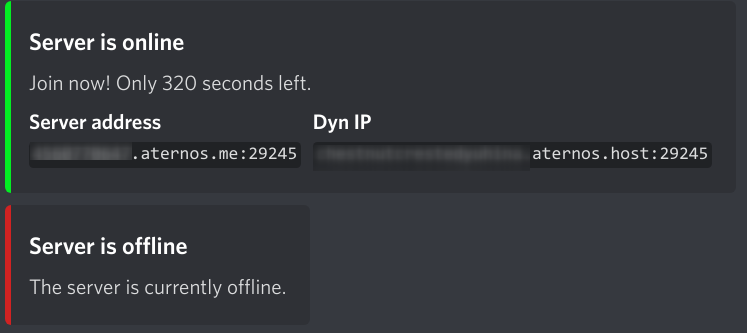

# aternos discord bot
Simple [Aternos](https://aternos.org/) discord bot to start and stop your Minecraft server with ease.

Built using [aternos-api](https://github.com/sleeyax/aternos-api).

## Screenshots
Starting and stopping the server is fully **asynchronous**. You can query the current status at any time:


And you'll get notified once the server is online or goes offline:




## Installation
```
$ go get github.com/sleeyax/aternos-discord-bot
```

## Usage

```go
package main

import (
	"fmt"
	discord "github.com/sleeyax/aternos-discord-bot"
	"os"
	"os/signal"
	"syscall"
)

func main() {
	// Create bot instance.
	bot := discord.AternosBot{
		Prefix:        "!",
		DiscordToken:  "<your discord bot token>",
		SessionCookie: "<your aternos session cookie>",
		ServerCookie:  "<your aternos server cookie/id>",
	}
	
	// Start the bot (errors are omitted for simplicity reasons).
	bot.Start()
	
	// Stop the bot when the main function ends.
	defer bot.Stop()

	// Block the main thread so the bot keeps running.
	// In this case we wait until 'CTRL + C' or another termination signal is received.
	fmt.Println("Bot is now running.  Press CTRL-C to exit.")
	interruptSignal := make(chan os.Signal, 1)
	signal.Notify(interruptSignal, syscall.SIGINT, syscall.SIGTERM, os.Interrupt, os.Kill)
	<-interruptSignal
}
```

### Docker
You can also run the bot in a docker container:

`$ docker run -d --name aternos-discord-bot -e DISCORD_TOKEN="" -e ATERNOS_SESSION="" -e ATERNOS_SERVER="" sleeyax/aternos-discord-bot`

## License
Licensed under `MIT License`.

[TL;DR](https://tldrlegal.com/license/mit-license):
> A short, permissive software license.
> Basically, you can do whatever you want as long as you include the original copyright and license notice in any copy of the software/source.
> There are many variations of this license in use.
