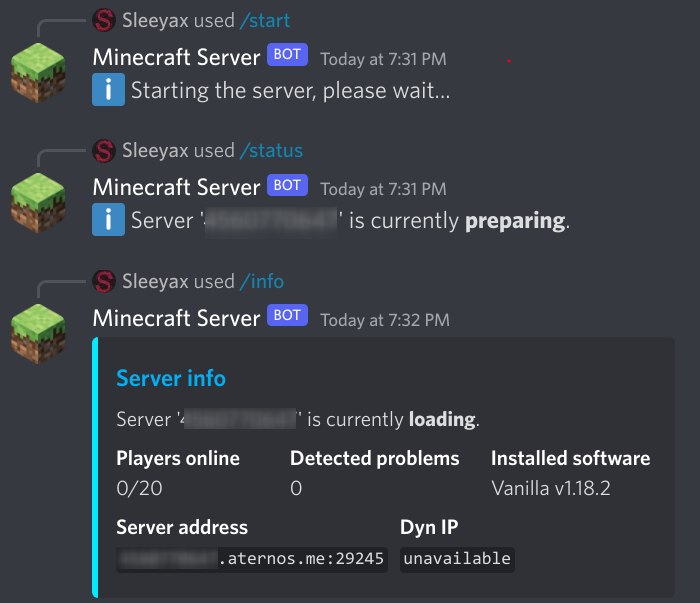

# aternos discord bot
Simple [Aternos](https://aternos.org/) discord bot to start and stop your Minecraft server with ease.

Built using [aternos-api](https://github.com/sleeyax/aternos-api).

## Screenshots
Starting and stopping the server is fully **asynchronous**. You can query the current status at any time:



And you'll get notified once the server goes online or offline:


## Usage
There's several ways to get this bot up and running, but before you get started make sure you have a [discord bot token](https://discord.com/developers/applications/) and the required cookie values for `ATERNOS_SERVER` and `ATERNOS_SESSION`.

To get the latter, go to [your aternos server page](https://aternos.org/server/), 
make sure you're logged in and hit `CTRL + SHIFT + I` on your keyboard. 
Then click on the tab `Storage` (Firefox) or `Application` (Chrome) to see the cookies and copy their values. 
Note that cookies won't expire as long as you stay logged in. 
In case you ever log out from aternos in your browser, you'll need to reconfigure the bot.

In all usage examples below you'll have to replace `""` with `"<value here>"` where `<value here>` is your token or cookie value.

### CLI
Install the binary, set the required environment variables & run the bot:
```
$ go install github.com/sleeyax/aternos-discord-bot
$ DISCORD_TOKEN="" ATERNOS_SESSION="" ATERNOS_SERVER="" aternos-discord-bot
```
Alternatively you can also run the latest version from source:
```
$ git clone https://github.com/sleeyax/aternos-discord-bot.git
$ cd aternos-discord-bot
$ DISCORD_TOKEN="" ATERNOS_SESSION="" ATERNOS_SERVER="" aternos-discord-bot go run ./cmd/main.go
```

### Docker
You can also run the bot in a docker container:

`docker run -d --name aternos-discord-bot -e DISCORD_TOKEN="" -e ATERNOS_SESSION="" -e ATERNOS_SERVER="" sleeyax/aternos-discord-bot`

### Kubernetes
Deployment to a kubernetes cluster is also supported. 

1. Create a new namespace (optional): `kubectl create ns aternos-discord-bot`
2. Create a new secret containing the necessary environment variables (replace `<>` with your respective values): `kubectl create secret generic aternos-secrets --from-literal=DISCORD_TOKEN=<> --from-literal=ATERNOS_SERVER=<> --from-literal=ATERNOS_SESSION=<>`
3. Publish the deployment: `kubectl apply -n aternos-discord-bot -f ./kubernestes.yaml`

### Library
It's possible to integrate this package into existing go code. 
Useful if you want to further customize the bot or want to do additional things after launching it. 

Installation:

`go get github.com/sleeyax/aternos-discord-bot`

Code:
```go
package main

import (
	"fmt"
	discord "github.com/sleeyax/aternos-discord-bot"
	"os"
	"os/signal"
	"syscall"
)

func main() {
	// Create bot instance.
	bot := discord.AternosBot{
		Prefix:        "!",
		DiscordToken:  "<your discord bot token>",
		SessionCookie: "<your aternos session cookie>",
		ServerCookie:  "<your aternos server cookie/id>",
	}
	
	// Start the bot (errors are omitted for simplicity reasons).
	bot.Start()
	
	// Stop the bot when the main function ends.
	defer bot.Stop()

	// Block the main thread so the bot keeps running.
	// In this case we wait until 'CTRL + C' or another termination signal is received.
	fmt.Println("Bot is now running.  Press CTRL-C to exit.")
	interruptSignal := make(chan os.Signal, 1)
	signal.Notify(interruptSignal, syscall.SIGINT, syscall.SIGTERM, os.Interrupt, os.Kill)
	<-interruptSignal
}
```

## License
Licensed under `MIT License`.

[TL;DR](https://tldrlegal.com/license/mit-license):
> A short, permissive software license.
> Basically, you can do whatever you want as long as you include the original copyright and license notice in any copy of the software/source.
> There are many variations of this license in use.
